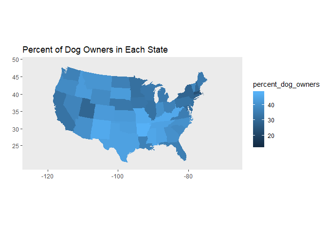

Test Mapping
================
Gregory Vitz
2018-09-10

Load the Data!

``` r
library(ggplot2)
library(stringr)
library(dplyr)
library(here)
library(rio)

cnd <- import(here("data", "cats_vs_dogs.csv"), setclass = "tbl_df") %>% 
  select(everything(), -V1)
```

``` r
cnd
```

    ## # A tibble: 49 x 12
    ##    state n_households percent_pet_hou~ n_pet_households percent_dog_own~
    ##    <chr>        <int>            <dbl>            <int>            <dbl>
    ##  1 Alab~         1828             59.5             1088             44.1
    ##  2 Ariz~         2515             59.5             1497             40.1
    ##  3 Arka~         1148             62.4              716             47.9
    ##  4 Cali~        12974             52.9             6865             32.8
    ##  5 Colo~         1986             61.3             1217             42.5
    ##  6 Conn~         1337             54.4              728             28.3
    ##  7 Dela~          334             56.6              189             33.7
    ##  8 Dist~          287             21.9               63             13.1
    ##  9 Flor~         7609             54.4             4138             35.7
    ## 10 Geor~         3798             55.1             2093             40.1
    ## # ... with 39 more rows, and 7 more variables: n_dog_households <int>,
    ## #   avg_dogs_per_household <dbl>, dog_population <int>,
    ## #   percent_cat_owners <dbl>, n_cat_households <int>,
    ## #   avg_cats_per_household <dbl>, cat_population <int>

Use geom\_map to put vales into state shapes

``` r
us <- map_data(map = "state")

cnd$state <- str_to_lower(cnd$state)

map_plot <- ggplot() +
  geom_map(data = cnd, map = us,
           aes(fill = percent_dog_owners, map_id = state),
           size = .15, color = NA) +
  expand_limits(x=us$long, y=us$lat) +
  scale_fill_continuous() +
  coord_map("albers", lat0 = 39, lat1 = 45) +
  labs(
    title = "Percent of Dog Owners in Each State",
    x = "",
    y = ""
    ) +
  theme(
    panel.grid = element_blank(),
    panel.grid.minor = element_blank()
  )

map_plot
```


